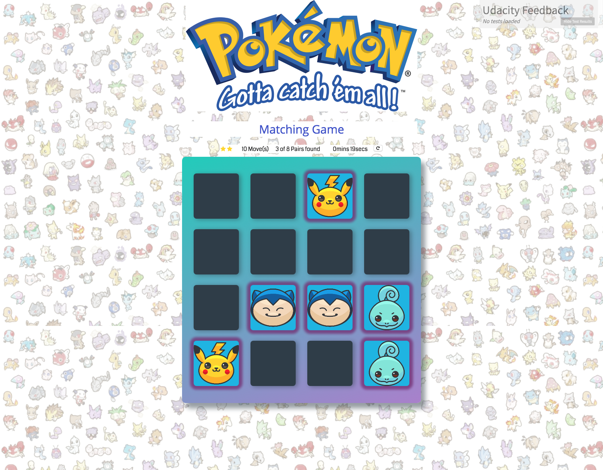

## Memory Game Project

## Challenge

Match the Pokemon in less time with less moves.

## How to Play
Load this link in your browser https://francisca80.github.io/memory-game/

## Instructions on how to play the matching game

Click on a card and find the matching Pokemon.
Keep playing until you found all the matching Pokemon.
Try to get faster and get them in less moves.
If all cards are matched you can see your ranking and time.

- 3 stars - less then  20 moves
- 2 stars - less then  30 moves
- 1 star -  more then  31 moves

You can restart the game to play again.
Have fun playing my  matching game!

## Why I made the Memory Game and what is in it.

After following the JScourses on Udacity,
I build this project as part of the nanodegree course with JS,CSS and HTML.

The game has
 -a deck of cards that shuffles when game is refreshed.
 -a timer to know how long it took to find al the matches.
 -a rating with stars for the moves and matches found.
 -added effects to cards when they match.
 -a pop-up modal when player finds all the pokemon with your scores.

  s
## Resources

The resources I used to make this game are:

- the Udacity starter code for project 3 of the FENDtrack.
- git and github
- for the images I used some images from the internet.
  the pokomon icons ford the cards: https://roundicons.com/
  the logo on the gamescreen : http://logos.wikia.com/wiki/File:Pok%C3%A9mon_Gotta_Catch_%27Em_All_1.png
  the happy winning pikachus on the modal: https://tenor.com/view/pikachu-happy-pokemon-gif-7408090
- the helpfull students and mentor from Udacity  
